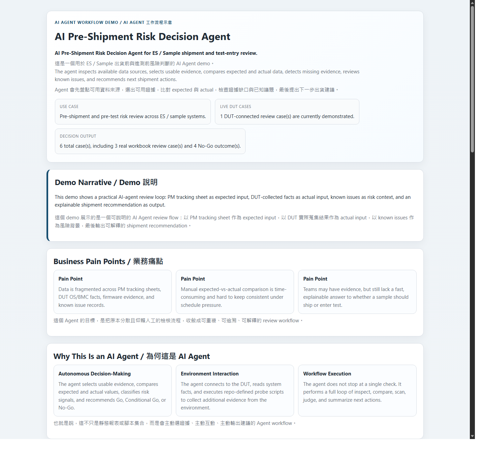
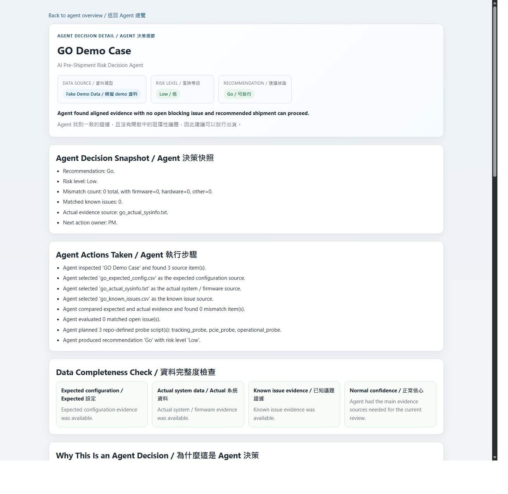
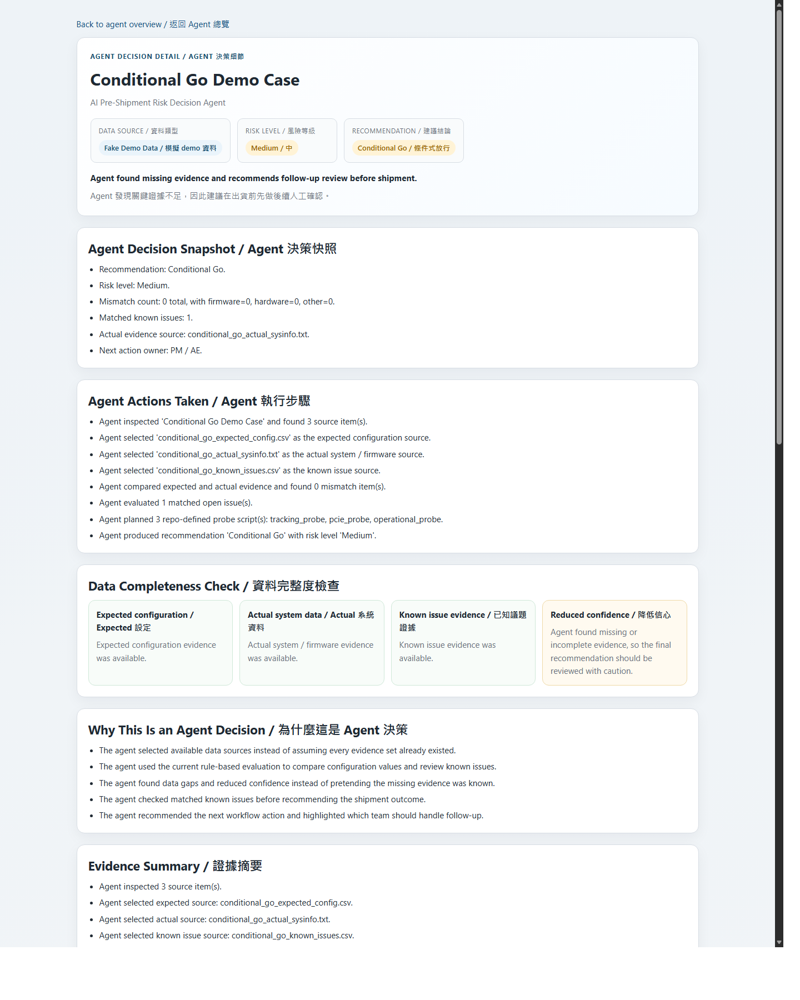
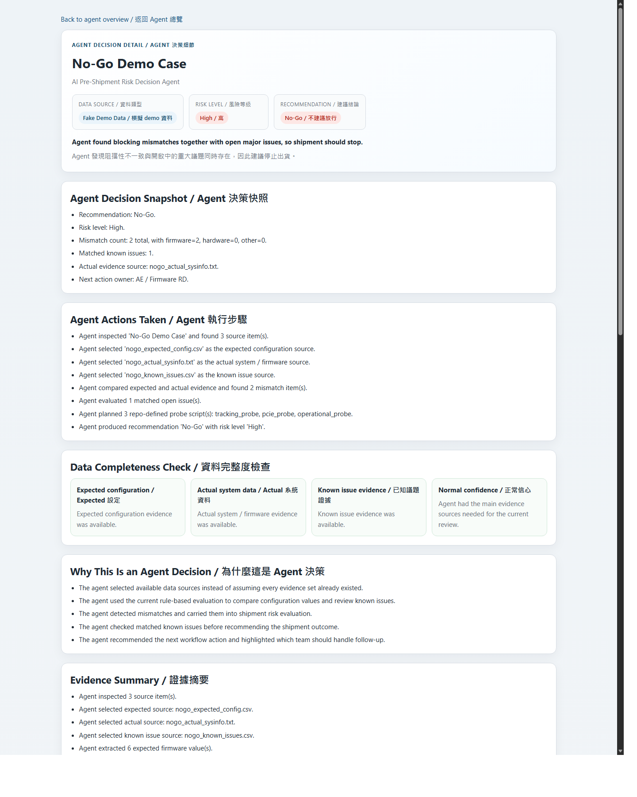

# AI Pre-Shipment Risk Decision Agent

> AI agent demo for ES and sample shipment review.  
> It inspects available evidence, compares expected versus actual data, reviews known issues, and explains why the result is `Go`, `Conditional Go`, or `No-Go`.

This repository is a runnable demo prototype for an internal AI competition. It explores how an AI agent can review shipment readiness before ES or sample shipment by inspecting available evidence, comparing expected versus actual system data, checking known issues, and recommending the next workflow action.

## Repo Banner
This is the short, front-page message for the repository. On GitHub, it works like the project pitch people see before they scroll into the details.

- Audience: PM, AE, DQA, RD, and demo reviewers
- Value: faster shipment-risk review with explainable reasoning
- Output: bilingual HTML review pages plus structured JSON
- Scope: demo-friendly prototype, not a production release

## What This Demo Shows
- Real workbook review flow for PM or AE tracking sheets
- Fake scenario review flow for clean demo storytelling
- Shared rule-based analysis structure across both flows
- Bilingual HTML output in English and Traditional Chinese
- Early DUT collection scaffold for the next project phase

## Core Agent Workflow
1. Inspect available inputs
2. Select usable evidence
3. Compare expected versus actual
4. Detect mismatches and missing evidence
5. Review known issues
6. Recommend `Go`, `Conditional Go`, or `No-Go`

## Current Capabilities
- Parse real Excel workbooks under `input_data/`
- Parse simplified cases under `demo_cases/`
- Generate JSON analysis outputs
- Generate bilingual HTML overview and detail pages
- Explain why the recommendation was made
- Suggest likely owner and next action

## Project Structure
- `demo.py`: main demo entry point
- `pre_shipment/`: parser, decision, rendering, and DUT adapter logic
- `demo_cases/`: public demo inputs for `Go`, `Conditional Go`, and `No-Go`
- `dut_command_sets/`: restricted DUT collection command profiles and scripts
- `NEXT_STEP.md`: implementation direction for the next phase
- `AGENTS.md`: project working rules

## Quick Start
This project uses Python and currently keeps the stack intentionally lightweight.

```bash
python demo.py
```

Generated outputs are written under `output/`, including JSON summaries and bilingual HTML pages.

## Demo Screenshots
### Overview Page


### Demo Cases
| Go | Conditional Go |
| --- | --- |
|  |  |

### Blocking Case


## Output Style
The HTML demo is designed to feel like an AI agent workflow, not just a static report. It highlights:
- what the agent inspected
- what evidence the agent selected
- where risk was detected
- why the recommendation was made
- who should handle the next action

## Public Repo Notes
This public repository intentionally excludes internal or customer-sensitive materials.

- `input_data/` is ignored from Git
- `output/` is ignored from Git
- `Document/` is ignored from Git

That means the public repo focuses on code, demo cases, and reproducible project structure rather than real shipment files.

## Current Limitations
- Decision logic is still rule-based
- Real workbook formats are not fully normalized
- Live DUT collection is scaffolded, not fully end-to-end
- Known issue matching is still a practical version 1 implementation
- The project is optimized for demo clarity, not production hardening

## Next Direction
The next major step is to move from workbook-only review toward a more practical shipment review loop:

1. Read PM tracking sheet as expected input
2. Collect actual data from DUT
3. Generate an actual execution sheet
4. Compare expected versus actual automatically
5. Render a shipment review result with explainable risk reasoning

## Recommendation Meaning
- `Go`: current evidence aligns and no blocking issue is detected
- `Conditional Go`: shipment can proceed only after follow-up review or missing evidence closure
- `No-Go`: blocking mismatch, blocking issue, or critical risk is detected

## Why This Repo Exists
This is not just a report generator. It is a practical demo of an AI agent that can help PM, AE, DQA, and RD understand shipment risk faster and with clearer reasoning.
